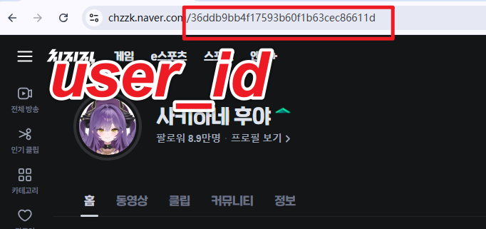
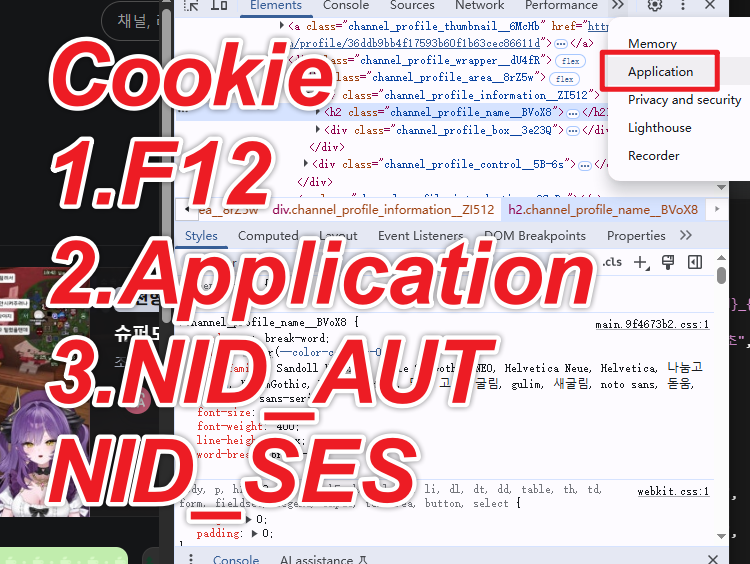

# Multi Chzzk Recorder

A powerful Chzzk live stream recording tool with multi-channel monitoring, automatic recording, transcoding, and notification features.

## 🚀 Quick Start

1. **Install Dependencies**
   ```bash
   pip install -r requirements.txt
   ```

2. **Configure Settings**
   - Copy `src/config/config_local.json.example` to `src/config/config_local.json`
   - Edit the configuration file and add your Chzzk authentication information

3. **Start Recorder**
   ```bash
   python main.py --mode recorder
   ```

4. **Start Web Management Panel**
   ```bash
   python main.py --mode web
   ```
   Then visit http://localhost:5000

## 📋 Features

- ✅ Multi-channel simultaneous recording
- ✅ Automatic live status detection
- ✅ Multiple recording quality options
- ✅ Auto-conversion to MP4 format
- ✅ Thumbnail and cover image generation
- ✅ Telegram/Discord notifications
- ✅ Modern web management panel
- ✅ English/Chinese bilingual support
- ✅ Chat recording functionality

## ⚙️ Configuration

### Authentication
- `nid_aut`: Chzzk authentication token
- `nid_ses`: Chzzk session token

### Recording Settings
- `quality`: Recording quality (best, worst, 720p, 480p, etc.)
- `recording_save_root_dir`: Recording files save directory
- `record_chat`: Whether to record chat

### Notification Settings
- `use_telegram_bot`: Enable Telegram notifications
- `telegram_bot_token`: Telegram Bot Token
- `telegram_chat_id`: Telegram Chat ID
- `use_discord_bot`: Enable Discord notifications
- `discord_bot_token`: Discord Bot Token
- `discord_channel_id`: Discord Channel ID

## 📁 Project Structure

```
recorder-release/
├── main.py                 # Main entry point
├── requirements.txt        # Python dependencies
├── src/
│   ├── core/              # Core recording logic
│   ├── api/               # API interfaces
│   ├── utils/             # Utility modules
│   ├── web/               # Web management panel
│   └── config/            # Configuration files
├── docs/                  # Documentation
├── examples/              # Example scripts
└── assets/                # Images and media files
```

## 🔧 Usage

### Adding Recording Channels
1. Start the web panel
2. Add channels in "Channel Management"
3. Enter channel ID or username
4. Save settings

### Manual Conversion
```bash
python examples/manual_convert.py
```

### Update Cookies
```bash
python examples/update_cookies.py
```

## 📸 Screenshots

### Web Management Panel

*Main dashboard showing recording status and channel management*

### Channel Management

*Add and manage recording channels with live preview*

### user_id/Channel ID which you want to rec

*Follow by the png*

### Cookies Get

*Record by your account's cookies*

## 📝 Notes

- First-time setup requires Chzzk authentication configuration
- Ensure sufficient disk space for recording
- Regularly clean up old recording files
- Web panel runs on port 5000 by default

## 🤝 Contributing

Contributions are welcome! Please feel free to submit issues and pull requests.

## 📄 License

MIT License - see [LICENSE](LICENSE) file for details.

## 🔗 Links

- 📖 Documentation: [docs/](docs/)
- 🐛 Issues: [GitHub Issues](https://github.com/yourusername/chzzk-recorder/issues)
- 💬 Discussions: [GitHub Discussions](https://github.com/yourusername/chzzk-recorder/discussions)