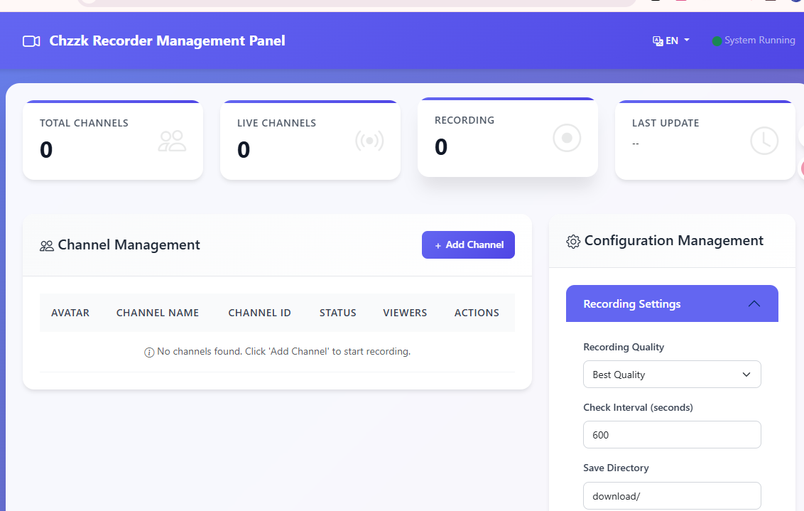
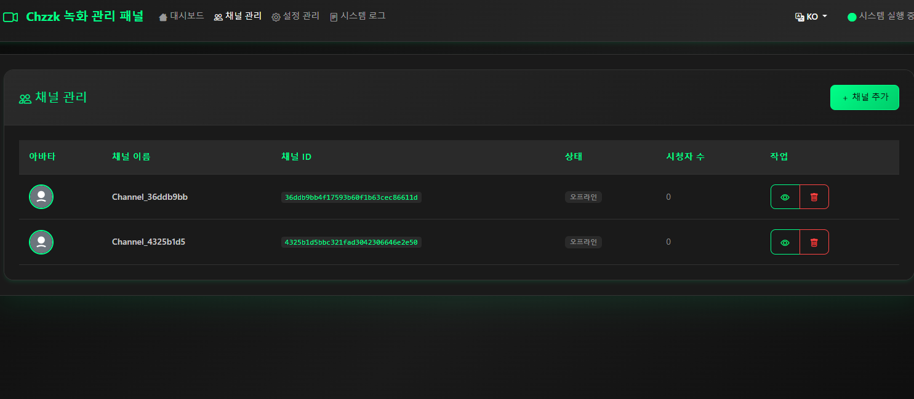
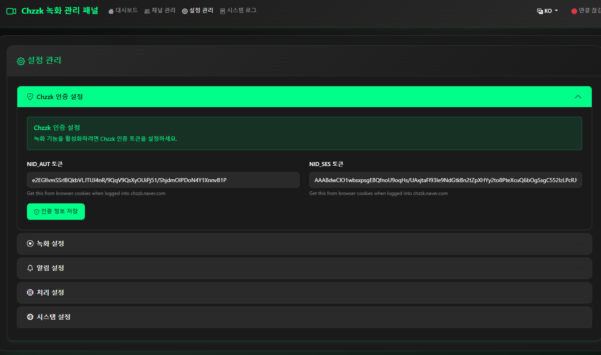
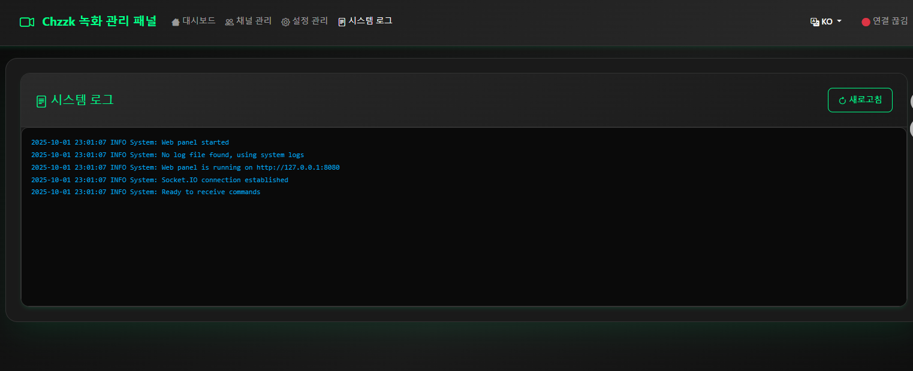

# Multi Chzzk Recorder Panel / 多频道Chzzk录制器面板 / 멀티 Chzzk 녹화기

A powerful Chzzk live stream recording tool with multi-channel monitoring, automatic recording, transcoding, and notification features.


一个功能强大的Chzzk直播录制工具，支持多频道监控、自动录制、转码和通知功能。
Chzzk 라이브 스트림 녹화를 위한 강력한 도구로, 다중 채널 모니터링, 자동 녹화, 트랜스코딩 및 알림 기능을 지원합니다.

## 📸 Screenshots / 截图 / 스크린샷

### Web Management Panel / Web管理面板 / 웹 관리 패널

*Main dashboard showing recording status and channel management / 主仪表板显示录制状态和频道管理 / 녹화 상태 및 채널 관리가 표시되는 메인 대시보드*

### Channel Management / 频道管理 / 채널 관리

*Add and manage recording channels with live preview / 添加和管理录制频道，带实时预览 / 라이브 미리보기와 함께 녹화 채널 추가 및 관리*

### Configuration Settings / 配置设置 / 설정 구성

*Comprehensive configuration options for recording, notifications, and processing / 录制、通知和处理的综合配置选项 / 녹화, 알림 및 처리를 위한 포괄적인 설정 옵션*

### System Logs / 系统日志 / 시스템 로그

*Real-time system monitoring and log viewing / 实时系统监控和日志查看 / 실시간 시스템 모니터링 및 로그 보기*

## 🚀 Quick Start / 快速开始 / 빠른 시작

### Prerequisites / 前置条件 / 사전 요구사항

- Python 3.8+
- FFmpeg
- Streamlink

### Installation / 安装 / 설치

1. **Clone the repository / 克隆仓库 / 저장소 클론**
   ```bash
   git clone https://github.com/yourusername/chzzk-recorder.git
   cd chzzk-recorder
   ```

2. **Install dependencies / 安装依赖 / 의존성 설치**
   ```bash
   pip install -r requirements.txt
   ```

3. **Configure settings / 配置设置 / 설정 구성**
   ```bash
   # Copy configuration file / 复制配置文件 / 설정 파일 복사
   cp src/config/config_local.json.example src/config/config_local.json
   # Edit configuration / 编辑配置 / 설정 편집
   ```

4. **Start recorder / 启动录制器 / 녹화기 시작**
   ```bash
   python main.py --mode recorder
   ```

5. **Start web panel / 启动Web面板 / 웹 패널 시작**
   ```bash
   python main.py --mode web
   # Open http://localhost:8080 in your browser / 在浏览器中打开 / 브라우저에서 열기
   ```

## 📋 Features / 功能特性 / 기능

- ✅ Multi-channel simultaneous recording / 多频道同时录制 / 다중 채널 동시 녹화
- ✅ Automatic live status detection / 自动检测直播状态 / 자동 라이브 상태 감지
- ✅ Multiple recording quality options / 多种录制质量选项 / 다양한 녹화 품질 옵션
- ✅ Auto-conversion to MP4 format / 自动转码为MP4格式 / MP4 형식으로 자동 변환
- ✅ Thumbnail and cover image generation / 生成缩略图和封面 / 썸네일 및 커버 이미지 생성
- ✅ Telegram/Discord notifications / Telegram/Discord通知 / 텔레그램/디스코드 알림
- ✅ Modern web management panel / 现代化Web管理面板 / 현대적인 웹 관리 패널
- ✅ Multi-language support (EN/CN/KO) / 多语言支持 / 다국어 지원
- ✅ Resume recording support / 断点续录支持 / 녹화 재개 지원

## ⚙️ Configuration / 配置说明 / 설정

### Authentication / 认证信息 / 인증 정보
- `nid_aut`: Chzzk authentication token / Chzzk认证token / Chzzk 인증 토큰
- `nid_ses`: Chzzk session token / Chzzk会话token / Chzzk 세션 토큰

### Recording Settings / 录制设置 / 녹화 설정
- `quality`: Recording quality (best, worst, 720p, 480p, etc.) / 录制质量 / 녹화 품질
- `recording_save_root_dir`: Recording files save directory / 录制文件保存目录 / 녹화 파일 저장 디렉토리
- `record_chat`: Whether to record chat / 是否录制聊天 / 채팅 녹화 여부

### Notification Settings / 通知设置 / 알림 설정
- `use_telegram_bot`: Enable Telegram notifications / 启用Telegram通知 / 텔레그램 알림 활성화
- `telegram_bot_token`: Telegram Bot Token / Telegram Bot Token / 텔레그램 봇 토큰
- `telegram_chat_id`: Telegram Chat ID / Telegram Chat ID / 텔레그램 채팅 ID
- `use_discord_bot`: Enable Discord notifications / 启用Discord通知 / 디스코드 알림 활성화
- `discord_bot_token`: Discord Bot Token / Discord Bot Token / 디스코드 봇 토큰
- `discord_channel_id`: Discord Channel ID / Discord频道ID / 디스코드 채널 ID

## 📁 Project Structure / 项目结构 / 프로젝트 구조

```
recorder-release/
├── main.py                 # Main entry point / 主入口文件 / 메인 진입점
├── requirements.txt        # Python dependencies / Python依赖 / Python 의존성
├── src/
│   ├── core/              # Core recording logic / 核心录制逻辑 / 핵심 녹화 로직
│   ├── api/               # API interfaces / API接口 / API 인터페이스
│   ├── utils/             # Utility modules / 工具模块 / 유틸리티 모듈
│   ├── web/               # Web management panel / Web管理面板 / 웹 관리 패널
│   └── config/            # Configuration files / 配置文件 / 설정 파일
├── docs/                  # Documentation / 文档 / 문서
├── examples/              # Example scripts / 示例脚本 / 예제 스크립트
└── assets/                # Images and media files / 图片和媒体文件 / 이미지 및 미디어 파일
```

## 🔧 Usage / 使用说明 / 사용법

### Adding Recording Channels / 添加录制频道 / 녹화 채널 추가
1. Start the web panel / 启动Web面板 / 웹 패널 시작
2. Add channels in "Channel Management" / 在"频道管理"中添加频道 / "채널 관리"에서 채널 추가
3. Enter channel ID or username / 输入频道ID或用户名 / 채널 ID 또는 사용자명 입력
4. Save settings / 保存设置 / 설정 저장

### Manual Conversion / 手动转换 / 수동 변환
```bash
python examples/manual_convert.py
```

### Update Cookies / 更新Cookie / 쿠키 업데이트
```bash
python examples/update_cookies.py
```


## 📝 Notes / 注意事项 / 주의사항

- First-time setup requires Chzzk authentication configuration / 首次使用需要配置Chzzk认证信息 / 처음 사용 시 Chzzk 인증 정보 구성 필요
- Ensure sufficient disk space for recording / 确保有足够的磁盘空间用于录制 / 녹화를 위한 충분한 디스크 공간 확보
- Regularly clean up old recording files / 建议定期清理旧的录制文件 / 오래된 녹화 파일 정기적 정리 권장
- Web panel runs on port 8080 by default / Web面板默认运行在8080端口 / 웹 패널은 기본적으로 8080 포트에서 실행